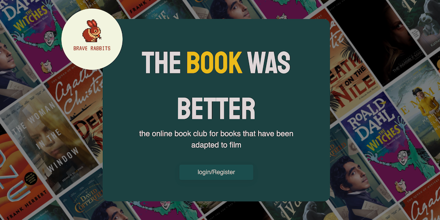
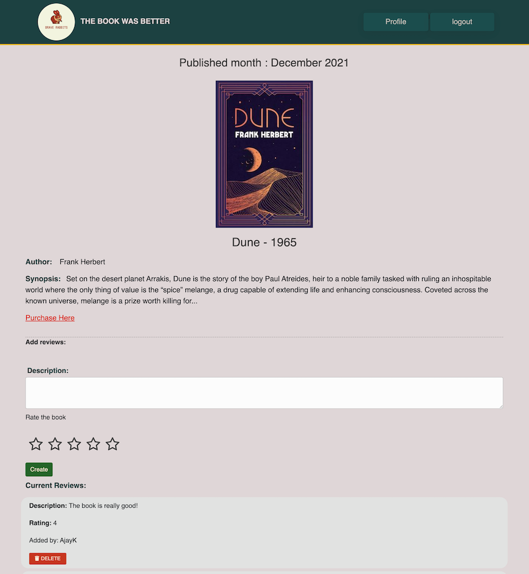
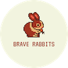

# THE BOOK WAS BETTER: book club

# Description
## *Nothing beats a great book…not even a great movie adapted from one!*

Welcome to The Book Was Better book club! We choose a book each month for our users to read, based on whether it has been adapted into a film. And at the end of each month, share your thoughts on the book with the community and find out whether the Book Was Better!

# User Story
```md
AS AN avid book and film enthusiast
I WANT to join an online community that reads books adapted to film 
SO THAT I can read and discuss with the community and compare said book to the film.
```

# Usage
Our Landing page has an option that allows users to either register an account or log in to join our book club community.

Once they have registered or logged into their account, they will be sent to their profile page wherein they will see the latest book of the month. Underneath the book image they will be given information about the book (including author, synopsis and date of publish) as well as a link to where the book can be purchased.

At the end of the page, they can submit their rating and review of the book as well as read reviews from other members of the community.

To create our website we used:
* *HTML*, *JavaScript* & *CSS* (*bootstrap/bootswatch*) for the front end layout 
* *Express.js*, *Node.js*, *MYSQL*, *Sequelize*, *Handlebars* and *Authentication* (crypt, cookies and express-session) for the backend.
* For deployment, we used *Heroku*.


# Mock Up
Our book club has been deployed on Heroku   ->   https://the-book-was-better-book-club.herokuapp.com/

Below is the login/register page:




And below is the main book of the month page:




# Future Developments
In the future we would like to include the following features to our online book club:

* a preview of the next month's book and where to purchase it.
* a link to film adapation of the book.
* an archive of previous books.
* and a choice of different clubs depending on reading speeds as well as preference of material ie; thriller, drama and romance.

# Credits
This website was created by:

 


*Ajay Kulkarni*    |    https://github.com/ajaykulkarni01


*Madeleine Cosway*    |    https://github.com/madeleinesc


*Marc Malliate*    |    https://github.com/marcmalliate


*Ram Mohan*    |    https://github.com/rammohan944